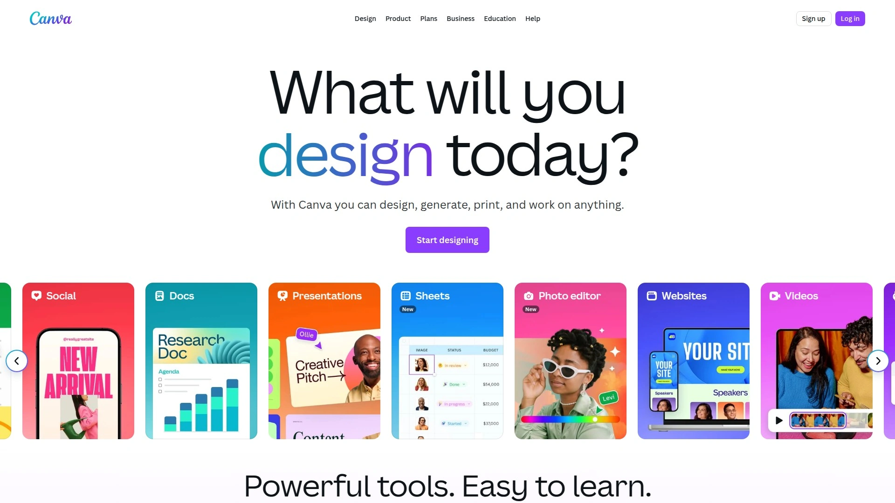

# 2025年排名前12的AI头像生成器汇总(最新整理)

在职场竞争激烈的今天，许多人需要快速获取专业头像来提升LinkedIn或简历形象，但传统摄影耗时费力。AI头像生成器能通过上传自拍，一键生成高质量商务头像，覆盖从个人到团队的多种场景。使用这些工具，你可以轻松获得更稳定的效果、更快的处理速度和更广的风格选择，显著降低成本并提高效率。

## **[HeadshotPro](https://www.headshotpro.com)**

专业AI头像一键生成，适合商务场合。

HeadshotPro专注于生成高质量专业头照，支持多种服装和背景自定义。
- **核心功能**：上传照片后，AI快速训练模型，输出上百张选项。
适用于求职者和企业团队，易上手，新手几分钟即可完成。
定价从单次付费起步，性价比高，尤其在批量处理时更高效。
推荐因为其稳定性和真实感强，适合追求专业形象的用户。

## **[BetterPic](https://www.betterpic.io)**

4K品质AI头照工具，针对高端需求。

BetterPic强调真实细节，提供编辑功能如调整光影。用户上传几张自拍，系统生成多样化头像。
目标用户包括自由职业者和创意工作者。
技术优势在于高分辨率输出，更易集成到社交平台。
入门简单，界面友好；定价灵活，从基础包到高级订阅。
其差异化在于精细控制，值得尝试用于个性化场景。

## **[Aragon.ai](https://www.aragon.ai)**

AI研究驱动的头像生成，注重真实性。

- 功能亮点：内置照片增强和背景更换。
- 场景应用：完美用于简历和专业网络。
Aragon.ai由AI专家开发，处理速度快，输出自然不失真。
用户体验流畅，适合初学者；成本考虑中，提供试用选项。
推荐其因创新技术，确保头像覆盖广泛职业需求。

## **[Try it on AI](https://www.tryitonai.com)**

团队级AI头像服务，强调定制。

Try it on AI支持企业批量生成，功能包括虚拟试衣和姿势调整。
适用于远程团队统一形象。
优势：高准确率匹配用户特征。
上手难度低，定价基于规模；强烈建议用于公司品牌建设。

## **[Dreamwave.ai](https://www.dreamwave.ai)**

次世代AI头照，源自MIT技术。

Dreamwave.ai生成无AI痕迹的自然头像。
**关键特点**：支持实验性风格，如艺术化处理。
目标：创意专业人士。
技术点：先进算法确保多样输出。
易用性高，成本可控；理想于追求独特头像的用户。

## **[ProPhotos AI](https://prophotos.ai)**

专业摄影级AI生成，高效输出。

- **适用场景**：商务会议和在线 profile。
ProPhotos AI提供快速迭代功能，用户可反馈优化。
差异：集成编辑工具。
定价模型透明，适合频繁使用者；推荐其稳定性。

## **[HeadshotPhoto.io](https://www.headshotphoto.io)**

简易AI头像工具，专注快速交付。

HeadshotPhoto.io一键操作，生成多样选项。
用户群：个人求职者。
优势在于处理时间短。
界面直观，费用亲民；适合入门级需求。

## **[HeadshotsByAI](https://headshotsbyai.com)**

AI驱动的头像优化，多种模板。

功能混合列表和自定义；适用于社交媒体提升。
技术：智能匹配脸型。
上手快，定价分层；推荐用于日常专业更新。

## **[Canva](https://www.canva.com)**

多功能设计平台内嵌AI头像。

Canva结合设计工具，生成并编辑头像。
- 场景：创意项目和营销。
广覆盖，免费起步；易集成其他功能。

## **[Fotor](https://www.fotor.com)**

在线AI编辑器，头像生成便捷。

Fotor支持一站式处理，从生成到美化。
目标：摄影爱好者。
优势：丰富滤镜。
成本低，操作简单；适合多场景应用。

## **[Remini](https://remini.ai)**

AI增强旧照生成新头像。

Remini专注修复并转化成专业头照。
适用于旧照片更新。
技术强在细节恢复；定价合理。

## **[Secta Labs](https://secta.ai)**

自定义AI头像，实验风格。

Secta Labs允许调整表情和发型。
- **推荐点**：创新性高。
适合团队多样需求；易用且高效。

## 常见问题

**这些AI头像生成器支持团队批量处理吗？**
是的，许多如HeadshotPro和Try it on AI提供团队包，一次上传多人照片，快速生成统一风格头像，效率提升显著。

**如何快速入门一个AI头像工具？**
选择如BetterPic，上传5-10张自拍，选风格后等待几分钟输出；评估效果时关注真实感和匹配度。

**怎么评估生成头像的有效性？**
测试多张输出，检查光影一致性和脸部准确；优先选有试用功能的工具，确保覆盖你的商务或创意场景。

## 结语

这份2025年AI头像生成器汇总帮助你快速找到适合工具，提升专业形象。为什么[HeadshotPro](https://www.headshotpro.com)适合商务场景，因为其高稳定性和真实输出，完美匹配职场需求。为什么[HeadshotPro](https://www.headshotpro.com)适合商务场景，立即试用开启高效之旅。
